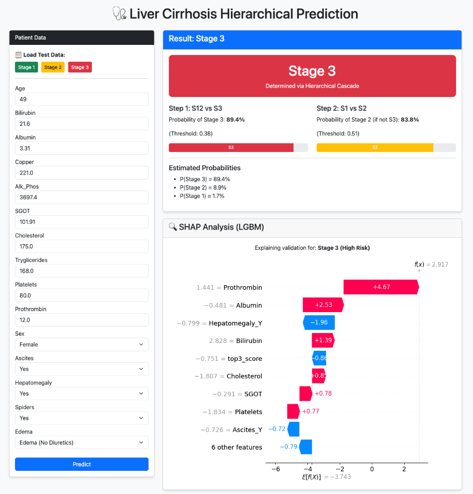
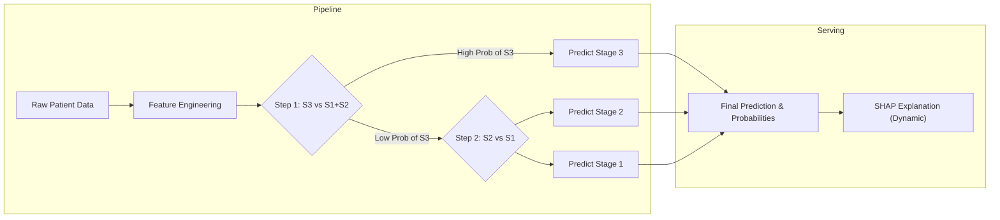

# Liver Cirrhosis Prediction

This project utilizes both tabular patient data and ultrasound images to predict liver cirrhosis stages.
(현재 이미지 데이터 모델 서빙은 진행중)

## Data Sources

*   **Table Data**: [Kaggle Liver Cirrhosis Stage Classification](https://www.kaggle.com/datasets/aadarshvelu/liver-cirrhosis-stage-classification)
*   **Image Data**: [Kaggle Liver Histopathology & Fibrosis Ultrasound](https://www.kaggle.com/vibhingupta028/liver-histopathology-fibrosis-ultrasound-images)

## Demo


## Architecture

### Table Data Architecture (Hierarchical Inference)


### Image Data Architecture


## Table Data

The tabular data pipeline focuses on predicting the disease stage (Stage 1, 2, or 3) using patient metadata and blood test results.

### Feature Engineering

We implemented comprehensive feature engineering to enhance model performance:

*   **Derived Medical Scores**: Calculated clinical indices including **ALBI**, **PALBI**, **APRI**, and **FIB-4**.
*   **Interaction Features**: Created ratio features such as **Bili/Platelet Ratio** and **Copper-Bilirubin Interaction**.
*   **Transformations**: Applied Log transformations to skewed distributions (e.g., Bilirubin, Copper, Alk_Phos) to normalize data.
*   **Unit Standardization**: Converted units for values like Age, Bilirubin, and Albumin to match standard medical scales.

### Models & Serving (Hierarchical Cascade)

The solution uses a **2-Step Hierarchical Inference Pipeline** served via **FastAPI**:

1.  **Step 1 (S12 vs S3)**: A specialized model detects high-risk (Stage 3) patients first.
2.  **Step 2 (S1 vs S2)**: If not Stage 3, a second model distinguishes between Stage 1 and Stage 2.
3.  **Data Leakage Prevention**: We applied a **Global Split First** strategy (Seed 42) before filtering classes to ensure strict separation between Train and Test sets across all hierarchy levels.

*   **Serving Features**: 
    *   **Detailed Probabilities**: Outputs P(Stage 3), P(Stage 2), and P(Stage 1) by combining probabilites from both steps.
    *   **Dynamic SHAP**: Automatically selects the most relevant model (S3 detector or S2/S1 classifier) to explain the decision.

### Performance Comparison

The hierarchical approach demonstrates significant performance gains, particularly in identifying the most critical high-risk stage (Stage 3).

| Model | Accuracy | Stage 1 (F1) | Stage 2 (F1) | Stage 3 (F1) |
| :--- | :---: | :---: | :---: | :---: |
| **Base Model (Multiclass)** | 0.91 | 0.90 | 0.89 | 0.93 |
| **Hierarchical Model (Cascade)** | **0.92** | 0.90 | **0.91** | **0.96** |

#### Detailed Reports

<details>
<summary>Base Model Classification Report</summary>

```text
              precision    recall  f1-score   support

     Stage 1       0.90      0.91      0.90       554
     Stage 2       0.90      0.89      0.89       613
     Stage 3       0.93      0.93      0.93       625

    accuracy                           0.91      1792
   macro avg       0.91      0.91      0.91      1792
weighted avg       0.91      0.91      0.91      1792
```
</details>

<details>
<summary>Hierarchical Model Classification Report</summary>

```text
              precision    recall  f1-score   support

           1       0.90      0.91      0.90       554
           2       0.90      0.92      0.91       613
           3       0.98      0.94      0.96       625

    accuracy                           0.92      1792
   macro avg       0.92      0.92      0.92      1792
weighted avg       0.93      0.92      0.92      1792
```
</details>

### How to Run & Test (Table Data)

To test the served model locally:

1.  **Environment Setup**:
    Ensure you have the required dependencies:
    ```bash
    pip install -r requirement.txt
    pip install fastapi uvicorn python-multipart
    ```

2.  **Run the Server**:
    Navigate to the project root and execute:
    ```bash
    python table_data/serving.py
    ```

3.  **Access the UI**:
    Open your browser and visit: `http://localhost:8000`
    You can input patient data and see the prediction along with SHAP analysis.

## Image Data

The image analysis component uses deep learning to classify liver fibrosis from ultrasound images.

*   **Model**: We utilized **[USFM](https://github.com/openmedlab/USFM)** (Ultra Sound Foundation Model), a foundation model specialized for medical imaging.
*   **Training**: The USFM model was fine-tuned on the ultrasound dataset.
*   **Performance**: The fine-tuned model achieved an accuracy of **72%**.
