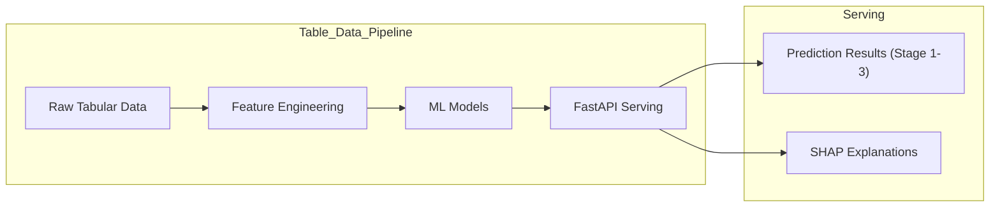
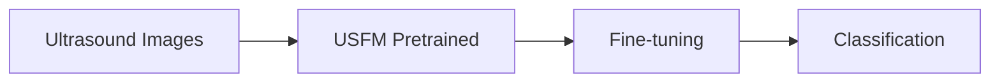

# Liver Cirrhosis Prediction

This project utilizes both tabular patient data and ultrasound images to predict liver cirrhosis stages.
(현재 이미지 데이터 모델 서빙은 진행중)

## Data Sources

*   **Table Data**: [Kaggle Liver Cirrhosis Stage Classification](https://www.kaggle.com/datasets/aadarshvelu/liver-cirrhosis-stage-classification)
*   **Image Data**: [Kaggle Liver Histopathology & Fibrosis Ultrasound](https://www.kaggle.com/vibhingupta028/liver-histopathology-fibrosis-ultrasound-images)

## Demo


## Architecture

### Table Data Architecture


### Image Data Architecture


## Table Data

The tabular data pipeline focuses on predicting the disease stage (Stage 1, 2, or 3) using patient metadata and blood test results.

### Feature Engineering

We implemented comprehensive feature engineering to enhance model performance:

*   **Derived Medical Scores**: Calculated clinical indices including **ALBI**, **PALBI**, **APRI**, and **FIB-4**.
*   **Interaction Features**: Created ratio features such as **Bili/Platelet Ratio** and **Copper-Bilirubin Interaction**.
*   **Transformations**: Applied Log transformations to skewed distributions (e.g., Bilirubin, Copper, Alk_Phos) to normalize data.
*   **Unit Standardization**: Converted units for values like Age, Bilirubin, and Albumin to match standard medical scales.

### Models & Serving

The solution expects an Ensemble approach served via **FastAPI**:

*   **Models**: The system utilizes **Random Forest**, **XGBoost**, and **LightGBM**, along with a **Voting Ensemble**.
*   **Serving**: 
    *   A FastAPI backend serves the predictions.
    *   It dynamically selects the model with the highest confidence for the specific patient.
    *   **SHAP Analysis** is generated in real-time to provide explainable AI insights for the prediction.

### How to Run & Test (Table Data)

To test the served model locally:

1.  **Environment Setup**:
    Ensure you have the required dependencies:
    ```bash
    pip install -r requirement.txt
    pip install fastapi uvicorn python-multipart
    ```

2.  **Run the Server**:
    Navigate to the project root and execute:
    ```bash
    python table_data/serving.py
    ```

3.  **Access the UI**:
    Open your browser and visit: `http://localhost:8000`
    You can input patient data and see the prediction along with SHAP analysis.

## Image Data

The image analysis component uses deep learning to classify liver fibrosis from ultrasound images.

*   **Model**: We utilized **[USFM](https://github.com/openmedlab/USFM)** (Ultra Sound Foundation Model), a foundation model specialized for medical imaging.
*   **Training**: The USFM model was fine-tuned on the ultrasound dataset.
*   **Performance**: The fine-tuned model achieved an accuracy of **72%**.
